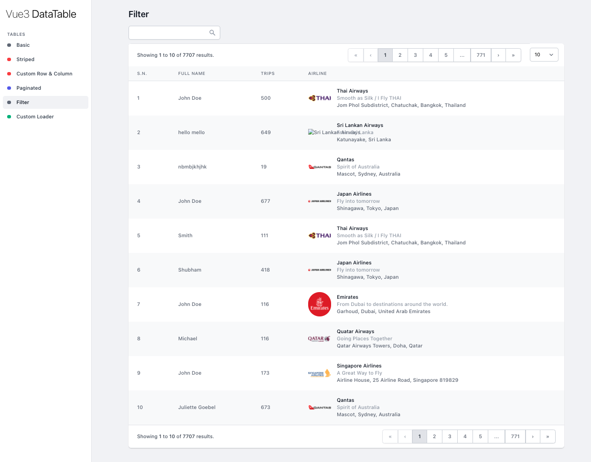

# DataTable - Vue3 Component

> Basic DataTable component for Vue3 in typescript and Composition API. It has basic functionality such as Filter/Search, pagination etc.

[](https://www.npmjs.com/package/@jobinsjp/vue3-datatable)
[](https://standardjs.com)
[](https://travis-ci.org/JoBinsJP/vue3-datatable)

## [Demo](https://vue3-datatable.netlify.app/)



## Install

```bash
npm install --save @jobinsjp/vue3-datatable

or,

yarn add @jobinsjp/vue3-datatable
```

## Usage

```vue
    <data-table :rows="data"/>
```

## License

MIT © [https://github.com/JoBinsJP/vue3-datatable](https://github.com/JoBinsJP/vue3-datatable)
